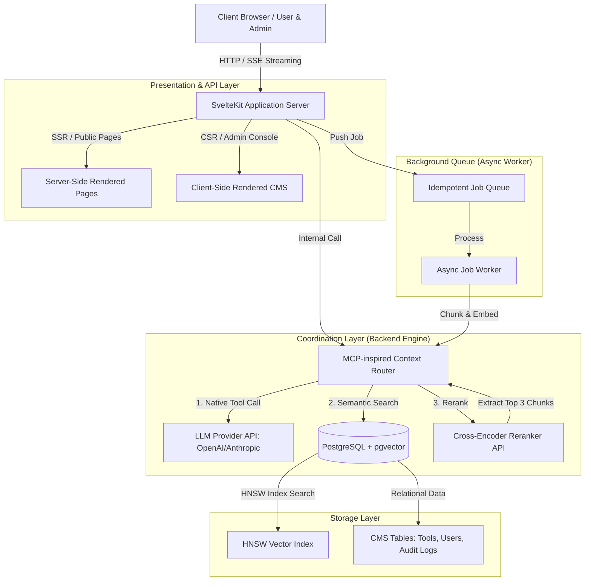

# Tài Liệu Thiết Kế Kiến Trúc Hệ Thống (ARCHITECTURE.md)

Tài liệu này đặc tả chi tiết kiến trúc kỹ thuật của hệ thống **DocumentHub (HUB-SYSTEM)**, mô tả các luồng dữ liệu, cấu trúc RAG (Retrieval-Augmented Generation), và mô hình Multi-Agent phục vụ hoạt động vận hành.

---

## 1. Mô Hình Tổng Quan (System Overview)

DocumentHub được xây dựng trên mô hình **Hybrid Storage** kết hợp tầng điều phối **MCP-inspired Context Router (Native Tool Calling)** nhằm giảm thiểu tiêu hao token đầu vào và tăng tốc độ phản hồi từ mô hình ngôn ngữ lớn (LLM).

Hệ thống được thiết kế theo hướng **Single-tenant operation nhưng Multi-tenant-ready** ở tầng cơ sở dữ liệu. Mọi bảng dữ liệu cốt lõi đều chứa thuộc tính `organization_id` để sẵn sàng mở rộng sang mô hình SaaS khi cần thiết.

### 📌 Sơ Đồ Kiến Trúc Hệ Thống (Mermaid Diagram)



---

## 2. Các Tầng Kiến Trúc Chi Tiết

### 2.1 Tầng Giao Diện & API (Presentation Layer)
*   **Trang Công Khai (Public Discover/Showcase):** Sử dụng chiến lược **Server-Side Rendering (SSR)** hoặc **Prerender**. Điều này giúp tối ưu hóa SEO tối đa, đảm bảo các bot tìm kiếm (Googlebot, Bingbot) có thể đọc đầy đủ cấu trúc trang, thẻ `<meta>` và dữ liệu cấu trúc `JSON-LD` được nhúng trực tiếp trong mã nguồn HTML mà không phụ thuộc vào việc thực thi JavaScript ở Client.
*   **Trang Quản Trị (CMS & AI Console):** Sử dụng chiến lược **Client-Side Rendering (CSR)** kết hợp với hệ thống lọc phiên đăng nhập (Session Security) và kiểm tra quyền hạn chi tiết (RBAC).

### 2.2 Tầng Điều Phối (Coordination Layer: `context-router.ts`)
Đóng vai trò như một bộ định tuyến thông minh điều phối ngữ cảnh:
1.  **Nhận Yêu Cầu:** Khi người dùng hỏi đáp tại Widget Chat của một Tool, Server Route (`/tools/[slug]/+server.ts`) sẽ mở kết nối luồng **Server-Sent Events (SSE)** để stream dữ liệu về Client.
2.  **Tool Calling:** Server gọi SDK LLM với cơ chế Native Tool Calling được định nghĩa sẵn. LLM tự động nhận diện ý định và gọi hàm `fetch_tool_context(query, tool_id)`.
3.  **Lọc dữ liệu & Namespace:** Tầng Context Router sẽ truy vấn cơ sở dữ liệu Postgres sử dụng bộ lọc cưỡng bức theo Namespace:
    ```sql
    WHERE organization_id = $1 AND tool_id = $2 AND is_deprecated = false
    ```
4.  **Tái xếp hạng (Reranking):** Kết quả tìm kiếm thô từ `pgvector` được đẩy qua bộ Rerank API (Cross-Encoder) để đánh giá mức độ tương thích ngữ nghĩa thực tế. Hệ thống chọn lọc đúng 3 đoạn văn bản (chunks) có điểm số cao nhất để đưa vào làm Context cuối cùng cung cấp cho LLM. Điều này giúp giảm tới 70% lượng input token dư thừa.

### 2.3 Tầng Cơ Sở Dữ Liệu (Storage Layer)
Hệ thống hợp nhất toàn bộ dữ liệu quan hệ (CMS, Users, Logs) và dữ liệu vector (Embeddings) vào **một cơ sở dữ liệu PostgreSQL duy nhất** có cài đặt extension `pgvector`.
*   **Chỉ mục Vector (Index):** Sử dụng **HNSW (Hierarchical Navigable Small World)** trên toán tử `vector_cosine_ops`.
*   **Chiến lược chống sụt giảm Recall (Iterative Index Scan):** Với các Tool có ít dữ liệu tài liệu (dưới 10 chunks), các thuật toán tìm kiếm ANN thông thường rất dễ bỏ sót dữ liệu. Context Router áp dụng cơ chế quét tuần tự bổ sung hoặc chỉ mục bán phần (`PARTIAL INDEX` theo `tool_id`) để đảm bảo không bị hiện tượng Under-return dữ liệu.

---

## 3. Quy Trình Phân Tách Tài Liệu (Structural Chunking Pipeline)

Hệ thống loại bỏ hoàn toàn cơ chế cắt văn bản thô theo số lượng ký tự cố định để tránh phá vỡ ngữ nghĩa cấu trúc.

```text
[Tài liệu tải lên (Markdown/PDF/TXT)]
                │
                ▼
      [Parser & Sanitizer] (Loại bỏ mã HTML độc hại, script)
                │
                ▼
    [Structural Splitter] (Cắt theo các Heading ##, ###, Code Blocks, List items)
                │
                ▼
       [Overlap Injector] (Chèn gối đầu ngữ cảnh 10% - 15% giữa các chunk liền kề)
                │
                ▼
      [Metadata Attachment] (Gắn heading_path, chunk_order, chunk_hash)
                │
                ▼
      [Embedding Generator] (Gọi Model text-embedding-3-small tạo vector 1536 chiều)
                │
                ▼
  [Database Batch Insert] (Ghi bất đồng bộ vào table tool_knowledge_vectors)
```

---

## 4. Mô Hình Hệ Thống Đa Agent (Multi-Agent Topology)

Hệ thống phân rã nhiệm vụ xử lý nội dung thành các Agent chuyên biệt, hoạt động độc lập và cộng tác thông qua cơ sở dữ liệu bản nháp (Draft-First Database Design).

| Tên Agent | Vai trò chính | Dữ liệu đầu vào | Dữ liệu đầu ra | Mô tả hành động |
| :--- | :--- | :--- | :--- | :--- |
| **Orchestrator Agent** | Nhận diện ý định | Câu lệnh người dùng | Phân loại Intent & Lệnh điều hướng | Định tuyến yêu cầu đến Agent xử lý đích |
| **Content Creator Agent** | Tóm tắt & Số hóa | Tài liệu thô dạng text | JSON Draft (Intro, Guide, FAQs) | Đọc hiểu tài liệu kỹ thuật để tạo nội dung cấu trúc |
| **QA/RAG Agent** | Hỗ trợ người dùng cuối | Query + Context (3 chunks) | SSE Streaming Text | Giải đáp trực tiếp trên trang chi tiết dự án |
| **Designer Agent** | Sinh mã đồ họa | Tên tool + Mô tả ngắn | Raw SVG Code | Sinh mã SVG Icon đại diện cho tool |
| **SEO Agent** | Tối ưu hóa tìm kiếm | Nội dung đã duyệt | Meta Title, Description, JSON-LD | Đảm bảo trang chi tiết đạt chuẩn SEO tốt nhất |
| **Changelog Agent** | Phân tích phiên bản | Tài liệu cũ + Tài liệu mới | Diff Content + Changelog Summary | Tạo bản nháp lịch sử thay đổi phiên bản |
| **Knowledge Refresh** | Cập nhật tri thức | Dữ liệu nháp được duyệt | Vector Embeddings | Chạy nền bất đồng bộ để index dữ liệu vào DB |

---

## 5. Kiến Trúc Hạ Tầng Vận Hành (Async Worker & Queue)

Để tránh gây tắc nghẽn luồng xử lý chính của người dùng (Main Request Thread), các tác vụ nặng được đẩy vào hàng đợi bất đồng bộ.

1.  **Job Queue:** Sử dụng cơ chế hàng đợi lưu trữ trong database (`jobs`, `job_attempts`) có hỗ trợ `idempotency_key` (sử dụng mã MD5/SHA256 của chunk dữ liệu) để đảm bảo dù job có bị trigger lại nhiều lần do mạng lỗi thì cũng không tạo ra các vector trùng lặp trong DB.
2.  **Worker Process:** Worker chạy trong một container riêng biệt (`worker`), liên tục quét hàng đợi để thực thi các tác vụ: gọi API Embedding, sinh SEO metadata, quét malware, và mã hóa khóa bảo mật.
3.  **Graceful Shutdown:** Khi có lệnh triển khai phiên bản mới, Worker sẽ nhận tín hiệu `SIGTERM`, dừng nhận job mới, hoàn thành nốt job đang xử lý hiện tại rồi mới tắt container để tránh tình trạng treo hoặc mất mát dữ liệu giữa chừng.
